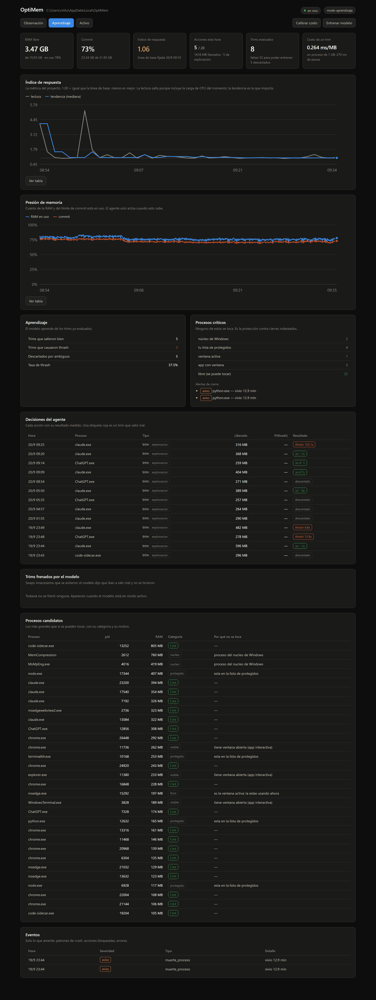

# OptiMem

Gestión predictiva de memoria para Windows. Mide la presión de memoria, aprende
**qué procesos se pueden vaciar sin costo**, y ajusta el paging en caliente sólo
cuando hace falta.

No es un "liberador de RAM". Esos purgan caché a lo bobo, y al hacerlo provocan
exactamente los swaps innecesarios que dicen evitar: obligan a releer de disco lo
que estaba caliente. OptiMem hace lo contrario — **predice el costo antes de
actuar y no toca lo que va a salir caro.**



---

## Qué hace

Windows expone dos palancas de memoria que se pueden mover **en caliente**, sin
reinicio y de forma reversible:

| Palanca | API | Qué hace |
|---|---|---|
| Working set | `SetProcessWorkingSetSize` | Vacía las páginas residentes de un proceso. La palanca dura. |
| Prioridad de memoria | `SetProcessInformation` | Le dice a Windows "desalojá de acá primero" y deja que el sistema elija las páginas realmente frías. La palanca suave. |

El **pagefile no se toca**: cambiarlo requiere registro + reinicio, así que no
es una palanca en tiempo real. Ver [lo que este proyecto no hace](#lo-que-este-proyecto-no-hace).

---

## Instalación

Requiere Windows y Python 3.10+.

```bash
git clone https://github.com/hoyosclaudio11-svg/OptiMem.git
cd OptiMem
python -m pip install -r requirements.txt
```

No hace falta ejecutar como administrador. Ver [sin admin](#sin-admin).

---

## Uso

```bash
python optimem.py capacidades      # qué palancas hay disponibles en esta máquina
python optimem.py calibrar         # cuánto cuesta vaciar un working set (una vez)
python optimem.py recolectar       # recolecta y hace correr el agente
python optimem.py panel            # panel en http://127.0.0.1:5215
```

O doble clic en `iniciar.bat`.

### El ciclo completo

```bash
# 1. Observar. Junta métricas sin tocar nada.
python optimem.py recolectar --modo observacion

# 2. Aprender. Trims exploratorios acotados para generar etiquetas.
python optimem.py recolectar --modo aprendizaje --activar
python optimem.py evaluar          # cuántas etiquetas hay
python optimem.py entrenar         # entrena el modelo

# 3. Actuar. Decide con el modelo.
python optimem.py recolectar --modo activo --activar

# El informe: la métrica de éxito.
python optimem.py informe
```

`recolectar` recolecta **y** hace correr el agente en el mismo proceso, a
propósito: el agente necesita la misma ventana de historia que se está
recolectando. Si corriera aparte, armaría las features con datos distintos a los
del entrenamiento y predeciría mal sin ningún síntoma visible.

### Que arranque solo

`recolectar_oculto.vbs` lanza el recolector sin ventana y lo relanza si se muere.
Buscá solo el `pythonw.exe` que tenga las dependencias instaladas, y lo recuerda
para no volver a adivinar. Poné un acceso directo en la carpeta de Inicio:

```powershell
$inicio = [Environment]::GetFolderPath('Startup')
$sh = New-Object -ComObject WScript.Shell
$lnk = $sh.CreateShortcut("$inicio\OptiMem.lnk")
$lnk.TargetPath = "C:\Windows\System32\wscript.exe"
$lnk.Arguments = '"' + (Get-Location).Path + '\recolectar_oculto.vbs"'
$lnk.WorkingDirectory = (Get-Location).Path
$lnk.Save()
```

---

## Cómo mide el éxito

Medir la latencia de las aplicaciones del usuario no sirve: cualquier tarea
programada contamina la medición y el cambio no se puede atribuir a OptiMem. Así
que el proyecto trae una **sonda propia**: un proceso que vive en segundo plano y
sostiene un working set, midiendo lo mismo que sufre una aplicación real.

| Medición | Qué detecta |
|---|---|
| `t_cache` | Leer un archivo que debería seguir en caché. Si la presión lo desalojó, sale de disco: salto de ~20x. |
| `t_ws` | Volver a tocar el propio working set. Si el sistema se llevó las páginas, hay que traerlas de vuelta. |
| `t_cpu` | Un lazo aritmético fijo: contención del planificador. |
| `t_memoria` | Asignar memoria nueva. Poco sensible, se mantiene como referencia. |

### El primer diseño de la sonda estaba mal

Medía cuánto tarda en asignar memoria nueva, que es lo que uno haría por
intuición. Se midió con 3 GB de presión controlada y el tiempo **bajó 8%**.

La razón: asignar memoria nueva se satisface con fallos de demanda cero, que
Windows sirve desde la lista de páginas libres **sin tocar el disco**. Sólo se
degrada cuando el sistema ya está thrashing, y para entonces es tarde para medir.

El segundo error del primer diseño: medía el disco con `FILE_FLAG_NO_BUFFERING`,
o sea salteando la caché a propósito. Pero la caché del sistema es justamente la
**víctima** de la presión de memoria. Medir con una sonda diseñada para no ver el
fenómeno no tiene sentido.

La sonda actual corre en un proceso que **vive** entre mediciones, y eso es
imprescindible: si el proceso renaciera cada vez, su buffer siempre estaría recién
fallado y nunca se podría detectar que se lo llevaron.

### Cuánto ruido tiene

Medido en la máquina de desarrollo, 10 corridas seguidas:

| medición | coeficiente de variación |
|---|---|
| memoria | 2,2% |
| cpu | 1,2% |
| disco | 13,1% |

Con los pesos actuales el índice queda en **±3,5%**, así que una mejora de más
del 10% es distinguible del ruido. Ese número es lo que hace defendible el
resultado del informe — y por eso el informe avisa explícitamente cuando una
diferencia está por debajo de ese umbral.

---

## Cómo aprende

Un "swap innecesario" acá no es una metáfora, es medible:

> Se vacía el working set del proceso P. Si P vuelve a tocar esas páginas poco
> después, el sistema tiene que traerlas de vuelta y la RAM liberada no sirvió
> para nada. Eso fue un swap innecesario.

```
reincidencia = fallos_por_minuto(después del trim) / fallos_por_minuto(antes)
etiqueta     = 1  si la reincidencia es alta y los fallos absolutos son significativos
```

El caso incómodo, que es donde estos proyectos suelen hacer agua: si el proceso
estaba **completamente inactivo** antes del trim y se activa después, no se puede
saber si fue por el trim o si le tocaba despertarse. Dividir por cero da un número
espectacular y falso. **Esas muestras se descartan en vez de etiquetarse.**

Cuánto cuesta un trim, medido (`validacion/costo_del_trim.py`):

```
re-tocar con paginas residentes :    21.86 ms
trim -> True, libero 342 MB
re-tocar tras el trim           :    54.38 ms
>>> el trim multiplico el costo por 2.49x
```

Ese costo lo paga **el proceso trimeado**, no el sistema entero. Por eso el
índice global puede no moverse aunque el modelo esté evitando pausas reales, y el
informe reporta las dos cosas por separado.

### Modos

| Modo | Qué hace |
|---|---|
| `observacion` | No toca nada. Registra qué habría hecho. |
| `aprendizaje` | Trims exploratorios acotados, sólo para generar etiquetas. |
| `activo` | Decide con el modelo entrenado. |

Sin exploración no hay etiquetas: nadie sabe de antemano qué trims salen mal. El
costo de aprender es que durante la fase de aprendizaje OptiMem **provoca a
propósito** algunos de los trims que después va a evitar. Está acotado por límites
por hora (20 acciones, 1.500 MB por defecto).

### Sólo actúa bajo presión

Si hay RAM de sobra, vaciar un working set no libera nada útil y sólo agrega el
riesgo de que el proceso tenga que releer. Es lo que separa a OptiMem de un
liberador de RAM de los que empeoran todo. Se activa si la RAM libre baja del 25%
o el commit pasa el 85% del límite.

### Honestidad de las métricas

- **Split por tiempo, no aleatorio.** Las acciones sobre un mismo proceso están
  correlacionadas; partir al azar mete la misma racha en train y en test e infla
  las métricas. Se entrena con el pasado y se evalúa con el futuro.
- **Línea de base explícita.** Un modelo que dice "ningún trim hace daño" acierta
  el 83% si el 83% de los trims son buenos. Siempre se reporta contra esa regla tonta.
- **Si no hay dos clases, no se entrena.** Con una sola clase no hay nada que
  aprender y cualquier métrica es ruido. Falla ruidosamente en vez de guardar un
  modelo inútil que después decide de verdad.

---

## Protección de procesos críticos

El módulo `critical.py` hace dos cosas distintas.

**Protección — evitar que OptiMem cause un cierre.** Antes de tocar cualquier
proceso se lo clasifica:

| Categoría | Se toca |
|---|---|
| `nucleo` — Windows, u otro usuario | nunca |
| `protegido` — lista configurable | nunca |
| `foco` — la ventana activa | nunca |
| `visible` — app con ventana abierta | nunca |
| `vigilado` — servicio de un solo uso | sólo la palanca suave |
| `libre` — proceso de fondo sin ventana | sí |

Vaciar el working set de la ventana en la que estás escribiendo es exactamente el
freeze que este proyecto dice evitar, así que el foco y las apps con ventana
quedan afuera por diseño.

**Vigilancia — detectar cierres que no provocamos.** Los procesos de `vigilar` se
siguen ciclo a ciclo. Acá hubo dos rediseños:

- Contar por **nombre** daba falsos positivos: cuatro scripts distintos de 40
  segundos no son un ciclo de crash, son un martes.
- Bajar el umbral tampoco: `python.exe` lo usan todos los scripts de una máquina.

La identidad tiene que ser la **línea de comandos**. El mismo script muriendo 3+
veces en una hora al poco de arrancar es un patrón; cuatro one-offs distintos no.
Las muertes sueltas se cuentan y no se reportan, para no construir otro healthcheck
que "reporta ERR siempre" y que nadie mira por ruidoso.

**Este módulo nunca mata nada.** No existe una función para terminar procesos, a
propósito.

---

## Lo que este proyecto no hace

- **No cambia el pagefile.** Requiere registro + reinicio. No es una palanca en
  tiempo real, y el objetivo era tiempo real.
- **No purga la standby list.** Requiere admin (`SeProfileSingleProcessPrivilege`)
  y además **empeora** la respuesta: tira la caché de disco y obliga a releer.
  Está implementada por completitud y el agente no la llama nunca solo.
- **No mata procesos.** Nunca.
- **No guarda los datos junto al código.** Van a `%LOCALAPPDATA%\OptiMem` porque
  la base se escribe cada segundo y sincronizarla a OneDrive/Dropbox quemaría CPU
  y arriesgaría corromper SQLite. Se cambia con `directorio_datos` en `config.json`.

---

## Sin admin

No hace falta. Medido en una máquina con 420 procesos:

```
Abribles con SET_QUOTA (trim): 271
RAM alcanzable por trim      : 14.57 GB de 18.38 GB
```

Y lo que no se puede tocar es justo lo que no se debería tocar: `MemCompression`,
Defender, `dwm`, `svchost`. Windows ya protege el núcleo. Las palancas que
requieren admin se detectan y se apagan solas, sin romper nada.

`python optimem.py capacidades` reporta qué hay disponible en cada máquina.

---

## Estructura

```
optimem.py             CLI
optimem/
  winapi.py            todas las llamadas al sistema, en un solo lugar
  collector.py         recolección + supervisión de la sonda + agente
  probe.py             la sonda de tiempo de respuesta
  critical.py          clasificación y vigilancia de procesos
  features.py          ingeniería de features (una sola definición, train y runtime)
  evaluator.py         cálculo de etiquetas
  trainer.py           entrenamiento y evaluación
  agent.py             el agente de decisión
  calibracion.py       cuánto cuesta un trim, medido
  server.py            panel web
  static/index.html    el panel
validacion/            los experimentos que decidieron el diseño
datos                  → %LOCALAPPDATA%\OptiMem
```

`config.json` se crea solo en el primer arranque y se puede editar a mano. El
recolector lo relee en cada ciclo: los cambios de modo valen sin reiniciar nada.

---

## Notas de implementación

Cuatro cosas que costaron tiempo y conviene no repetir si vas a trabajar con
estas APIs:

1. **`ctypes` sin `argtypes`/`restype` trunca los handles a 32 bits en x64.**
   `GetCurrentProcess()` devuelve el pseudo-handle `-1` y la llamada siguiente
   falla con un error que no dice nada útil sobre la causa.

2. **`commit` es palabra reservada de SQL.** La columna se llama `commit_bytes`.

3. **`GetPerformanceInfo` y `NtQuerySystemInformation` devuelven páginas, no
   bytes.** Comparar bytes contra páginas da una diferencia del 409.500% y un
   falso negativo que apaga una métrica que en realidad funciona. Además, la
   segunda usa una **estructura no documentada** cuyos offsets cambian entre
   versiones de Windows: el módulo la autovalida contra `psutil` al arrancar y la
   descarta si no cuadra.

4. **FastAPI ejecuta los endpoints síncronos en un pool de hilos** y `sqlite3`
   rechaza por defecto que una conexión se use desde otro hilo. El síntoma engaña:
   llamada a mano desde un script anda, por HTTP devuelve 500 en todo. El panel
   abre una conexión por petición.

Y una de diseño, que es la más importante: **medir no es lo mismo que medir lo
correcto.** La primera sonda de este proyecto medía algo real, con precisión
excelente, y que no tenía nada que ver con lo que decía medir. Los scripts de
`validacion/` existen para que ese error se detecte en una tarde y no en un mes.

---

## Estado

| Pieza | Estado |
|---|---|
| Recolección de métricas | Funcionando — 1 Hz sistema, 10 s por proceso |
| Sonda de tiempo de respuesta | Funcionando, con línea de base automática |
| Detección de procesos críticos | Funcionando — 6 categorías + vigilancia de crash loops |
| Agente de ajuste en tiempo real | Funcionando — 3 modos, límites por hora |
| Modelo de predicción | Circuito completo; **falta juntar muestras para entrenar** |
| Panel web | Funcionando |
| Informe de mejora | Funcionando |

El modelo necesita ~60 trims etiquetados. En modo aprendizaje se juntan a razón
de ~12 por hora, así que son unas 6 horas de recolección.

---

## Licencia

MIT — ver [LICENSE](LICENSE).
